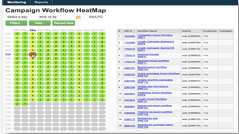
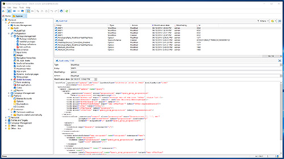
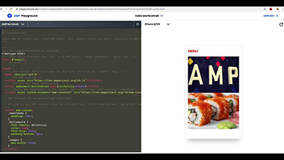

# Tutorials zu Adobe Campaign Classic v7

Adobe Campaign bietet eine Plattform zur Konzeption kanalübergreifender Kundenerlebnisse und stellt dazu eine Umgebung für die visuelle Kampagnenorchestrierung, die Echtzeit-Interaktionsverwaltung und die Cross-channel Execution bereit. Dieses Benutzerhandbuch enthält Videos und Tutorials zu den verschiedenen Funktionen und Leistungsmerkmalen von Adobe Campaign Classic V7.

>[!INFO]
> Haben Sie Fragen? Möchten Sie Ihre Erfahrungen mitteilen oder Ihre Gedanken mit anderen austauschen? Oder haben Sie Feedback zum Lerninhalt für das Adobe-Team? Beteiligen Sie sich an der Diskussion im [Thread der Adobe Campaign-Lern-Community](https://experienceleaguecommunities.adobe.com:443/t5/adobe-campaign-classic/join-the-discussion-on-adobe-campaign-learning/td-p/419096)!

## Mitarbeiterauswahl

<table>
<tr>
  <td>
    
    

      <a href="./monitoring-campaign-classic/workflow-heatmap.md">
    <strong>Workflow-Heatmaps</strong>
    </a>
    

    

    <em>Verschaffen Sie sich einen Überblick über die Zahl gleichzeitiger Workflows.</em>
    

  </td>
   <td>
    
    

      <a href="./monitoring-campaign-classic/audit-trail.md">
    <strong>Audit-Protokoll</strong>
    </a>
    
 
    

    <em>Erfassen Sie eine umfassende Liste von Aktionen und Ereignissen, die in Adobe Campaign auftreten.</em>
    

  </td>
  <td>
    
    

      <a href="./sending-messages/email-channel/defining-interactive-email-content-with-amp.md">
    <strong>Definieren interaktiver E-Mail-Inhalte mit AMP</strong>
    </a>
    

    

    <em>Erfahren Sie, wie Sie AMP in Adobe Campaign Classic aktivieren und verwenden.</em>
    

  </td>
</tr>
</table>

## Zusätzliche Ressourcen

* [Dokumentation](https://experienceleague.adobe.com/docs/campaign-classic/using/getting-started/starting-with-adobe-campaign/about-adobe-campaign-classic.html?lang=de)
